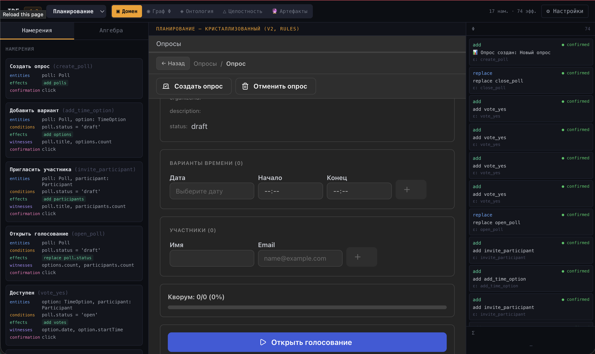
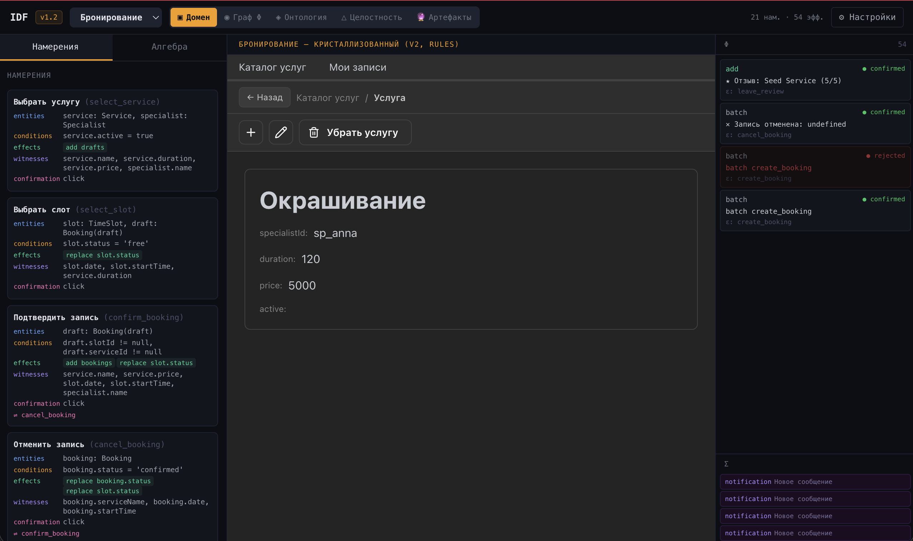
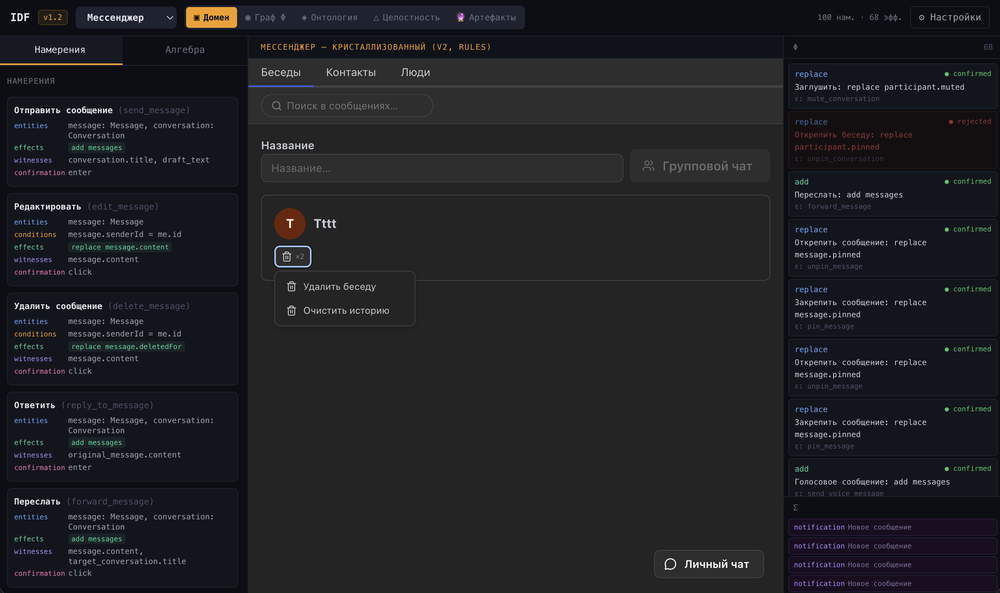
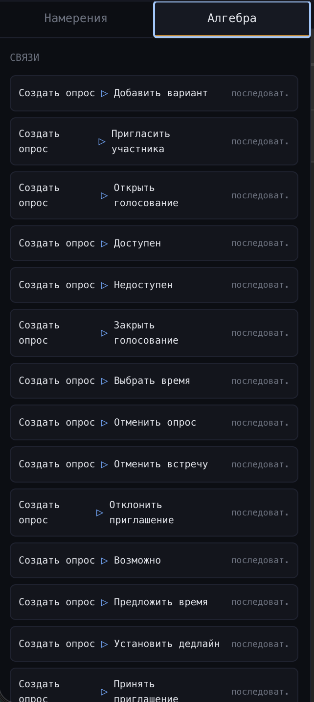
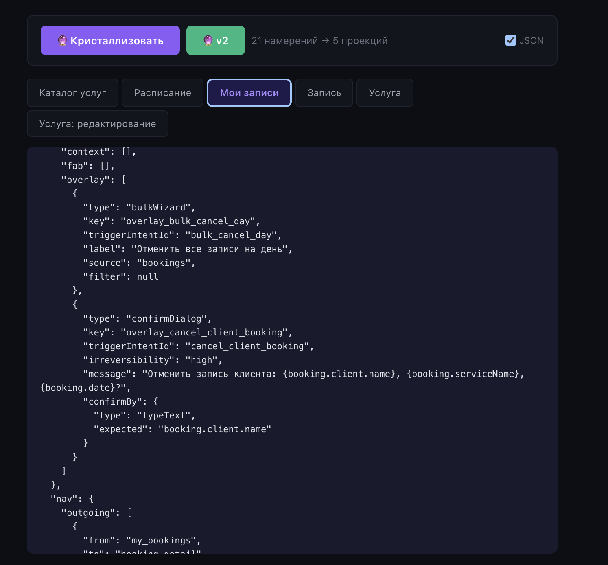
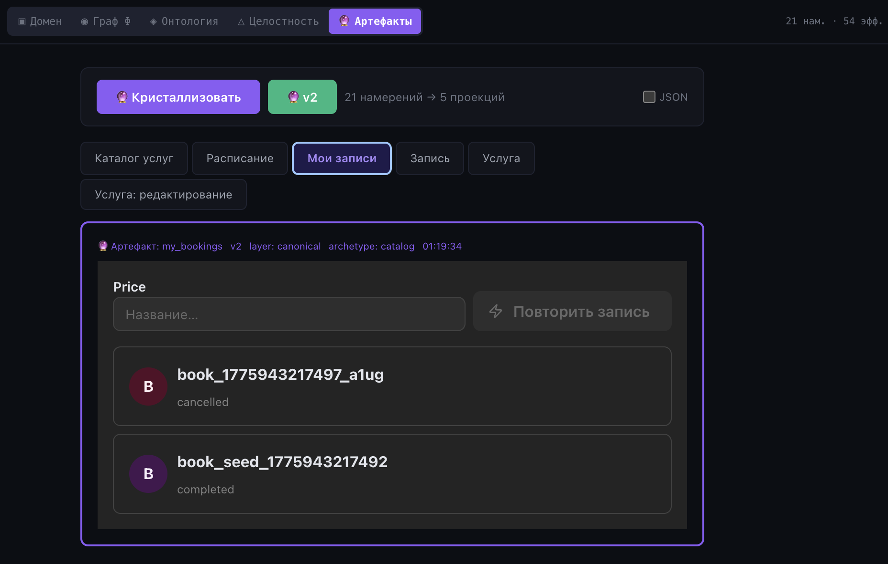
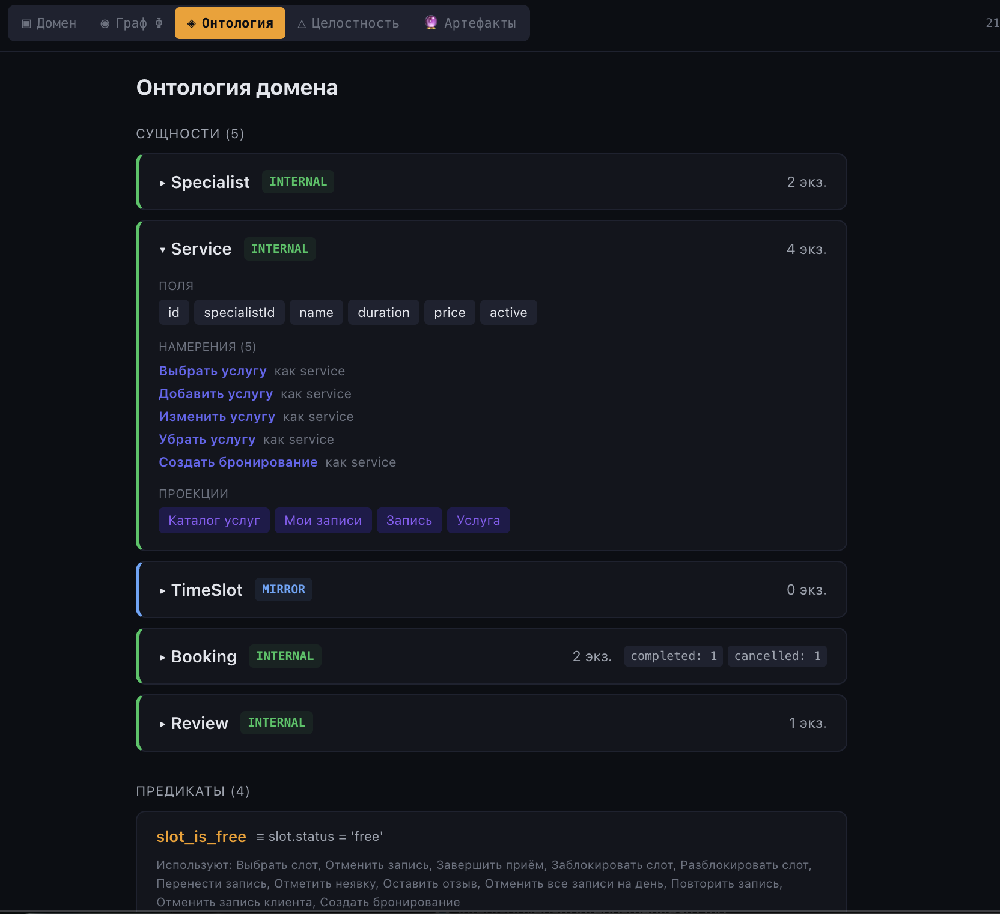
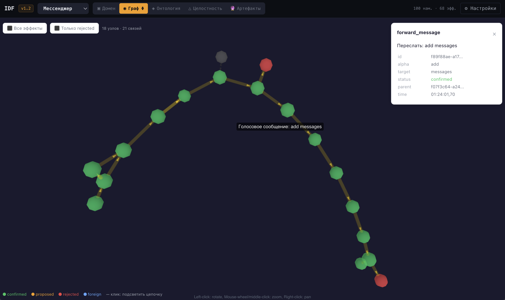

# Intent-Driven Frontend

**Парадигма сгенерированных UI, где LLM работает только в авторстве, а не в рантайме.**

Экспериментальный фреймворк и прототип одной идеи: приложения не пишутся вручную и не собираются в браузере LLM на лету, а **выводятся из формального описания пользовательских намерений**. Автор — режиссёр, ведущий диалог с моделью о том, *что* должно произойти; модель — соавтор, кристаллизующий это в исполнимый интерфейс. Рантайм — детерминированный: никаких запросов к API моделей во время использования приложения.




## Основной тезис

UI — это пересечение двух структур: **проекций** (что видит пользователь) и **намерений** (что он может сделать). Пиксели, голос, агентский API — лишь равноправные материализации этого пересечения.

Кристаллизация происходит **в авторстве**, не в рантайме. Когда пользователь нажимает кнопку, никакая LLM не участвует в решении, что показать или что применить — всё уже выведено заранее и задокументировано в артефакте проекции. LLM возвращается только когда автор меняет намерения, и результатом её работы становится новая версия артефакта, а не поведение во время исполнения.

Следствие: парадигма **фальсифицируема** — у неё есть формальная модель (см. манифест), проверяемая граница применимости (см. полевые тесты) и жёсткие инвариантные правила, которые либо выполняются, либо нет.

## Прототип

Четырёхдоменное приложение, **152 намерения** в одном потоке эффектов `Φ`:

- **Booking** (20 намерений) — онлайн-запись к специалистам: услуги, слоты, бронирования, отзывы.
- **Planning** (17 намерений) — совместное планирование встреч: опросы, голосование, кворум, дедлайны.
- **Workflow** (15 намерений) — редактор рабочих процессов с серверным исполнением через React Flow.
- **Messenger** (100 намерений) — полноценный мессенджер с real-time (WebSocket), WebRTC-звонками, групповыми чатами, редактированием, ответами, реакциями.

Один движок, один рантайм, один валидатор — четыре набора определений.

## Ключевые концепты

- **Намерение** (intent) — атом системы. Описывается набором частиц: сущности, условия, эффекты, витнессы, вид подтверждения. Автор формулирует намерения, модель помогает их отточить.
- **Проекция** — то, что видит пользователь. Не дизайн, не лайаут, а *формальная спецификация*: какие сущности показать, какими фильтрами и сортировками, в каком архетипе, какие кнопки и формы доступны.
- **Поток эффектов** `Φ` — единственный источник истины состояния. Мир вычисляется как свёртка подтверждённых эффектов. Эффекты проходят жизненный цикл `proposed → confirmed | rejected` и каскадно отвергаются при отказе предка.
- **Кристаллизация** — автоматическое построение артефакта проекции из намерений и онтологии. Детерминирована, перегенерируема, тестируема. В прототипе — rule-based (в долгосрочной — опционально LLM).
- **Архетипы и слоты** — формальный промежуточный слой между абстрактной проекцией и конкретной раскладкой. Пять архетипов (feed, catalog, detail, dashboard, canvas) покрывают все полевые тесты.
- **Три слоя проекции**: канонический (для человека), адаптивный (устройство/тема/иконки, реализован через UI-адаптер Mantine + Lucide), агентский (JSON-API для LLM-агента, живущего в общем `Φ` с людьми).





## Агентский слой

Демонстрация тезиса «LLM — равноправный пользователь намерений». Три REST endpoint'а (`schema`, `world`, `exec`) над booking-доменом под JWT превращают агента в обычного клиента интент-API: читает схему, фильтрует мир по своей роли, вызывает намерения, получает `proposed → confirmed | rejected` с таким же lifecycle'ом, как человек. Ролевой доступ (`canExecute`, `visibleFields`, `ownerField`) декларируется в онтологии, не в коде. Конфликт-rejection сценарий работает естественно: если два клиента (человек и агент) попытаются забронировать один слот, один получит 409 с `failedCondition.actualValue`, прочитает ошибку и переигрывает.

Нет никакого «адаптера для LLM», переводящего намерения в tool-calls — агент работает с теми же интентами, что и UI, просто через другой транспорт.

Подробный гайд с curl-примерами, списком кодов ответа, smoke-тестом и задачами для live demo — в [`docs/agent-demo.md`](docs/agent-demo.md). System prompt для запуска claude-code как агента — в [`docs/agent-system-prompt.md`](docs/agent-system-prompt.md).




## Как запустить

Требуется Node.js 20+.

```bash
npm install

# Терминал 1: основной сервер на :3001
npm run server

# Терминал 2: внешний мок-календарь на :3002
npm run calendar

# Терминал 3: Vite dev server на :5173
npm run dev
```

Откройте `http://localhost:5173`, переключатель доменов вверху.




### Маршруты

- `/` — IDF-каркас с панелями определений, потоком `Φ`, графом причинности, переключением доменов
- `/messenger-v2` — мессенджер, целиком на рендерере v2
- `/booking-v2`, `/planning-v2`, `/workflow-v2` — отдельные домены на рендерере v2
- `/booking`, `/planning`, `/workflow`, `/messenger` — legacy-рендерер v1 (живёт параллельно до M5)

### Тесты и сборка

```bash
npm test             # 158 unit-тестов (кристаллизатор v2, агентский слой)
npm run build        # production-сборка
npm run agent-smoke  # 11-шаговый integration test агентского слоя
```

## Что читать

Всё концептуальное живёт в трёх местах:

1. **[Манифест v1.3](docs/manifesto-v1.1.md)** — 26 разделов, формальное описание парадигмы: модель данных, алгебра эффектов, кристаллизация, границы применимости, честная ревизия манифеста против кода. Читать целиком, если интересно *почему*.
2. **[Полевые тесты 1–7](docs/)** — семь доменов, в которых парадигма проверялась на прочность. Каждый тест — это не «сделал и работает», а честное обсуждение: что сработало, что нет, что пришлось ввести новое, где обнаружились фундаментальные ограничения. Читать, если интересно *где парадигма ломается*.
3. **[Agent-demo](docs/agent-demo.md)** — как LLM-агент становится таким же клиентом booking-домена, как человек. Три REST endpoint'а, smoke-test из 11 шагов, задачи для live demo с claude-code в роли агента. Читать, если интересно *как на практике выглядит «UI — это не код»*.

Манифест обещает формализм, полевые тесты его проверяют, агентский слой показывает следствие.

## Статус

Исследовательский прототип. Не продакшен, не библиотека, не фреймворк для использования — **артефакт мышления**. Код работает, тесты проходят, но вся инфраструктура вокруг (deploy, CI, TypeScript, стабильный public API) отсутствует. Парадигма может быть интересна разработчикам, дизайнерам и исследователям, которые думают о том, как LLM и человек могут совместно авторствовать ПО.

## Границы применимости

Парадигма **фальсифицируема**, и это её сила. Она имеет явную зону силы и явную честно зафиксированную границу:

- **Зона максимальной силы:** транзакционные домены (e-commerce, финтех, бронирование).
- **Зона высокой силы:** темпоральные и коллаборативные домены (календари, опросы, мессенджеры).
- **Граница:** распределённые системы с eventual consistency, real-time collaborative editing (CRDT), системы с глубоким машинным обучением в рантайме, графические/пространственные редакторы (работает для CRUD на графе, но не покрывает автоматическое исполнение или пространственные свойства).

Подробнее — §21 манифеста «Транзакционный уклон парадигмы» и §23 «Слабые места и открытые задачи».

## Стек

- **Фронтенд:** React 19, Vite 8, Mantine (через UI-адаптер), Lucide icons, React Flow (workflow)
- **Бэкенд:** Node.js + Express, SQLite (better-sqlite3), WebSocket (ws), JWT + bcrypt
- **Кристаллизатор:** чистые функции JavaScript, тестируются через vitest
- **Агентский слой:** Node.js/CJS модули в `server/schema/*`, три REST endpoint'а в `server/routes/agent.js`

## Лицензия

[MIT](LICENSE). Используй, форкай, модифицируй, публикуй — на усмотрение. Гарантий никаких.
